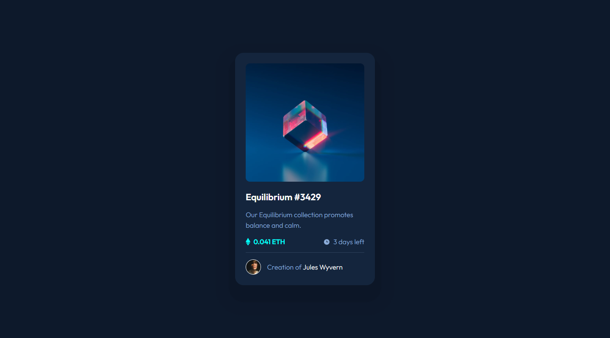
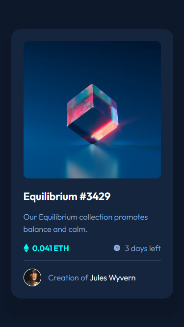

# Frontend Mentor - NFT preview card component solution

This is a solution to the [NFT preview card component challenge on Frontend Mentor](https://www.frontendmentor.io/challenges/nft-preview-card-component-SbdUL_w0U). Frontend Mentor challenges help you improve your coding skills by building realistic projects. 

## Table of contents

- [Overview](#overview)
  - [Screenshot](#screenshot)
  - [Links](#links)
- [My process](#my-process)
  - [Built with](#built-with)
  - [Continued development](#continued-development)
- [Author](#author)

## Overview

### Screenshot

### Links

- Live Site URL: [NFT preview card component](https://nft-preview-card-component.dodeun.com/)

## My process

### Built with

- Semantic HTML5 markup
- CSS custom properties
- Flexbox
- Mobile-first workflow
- SASS

### Continued development

- Try and use more class selectors in my sass instead of elements like p , div ... (Research if it realy is the way to go)

- Decide between a hierachic/descriptiv base naming of my color variables (primary, secondary, links ...) or a color base one (red, red-light, red-dark, green ...) or find how to use both.

## Author

- Frontend Mentor - [@Dodeun](https://www.frontendmentor.io/profile/Dodeun)